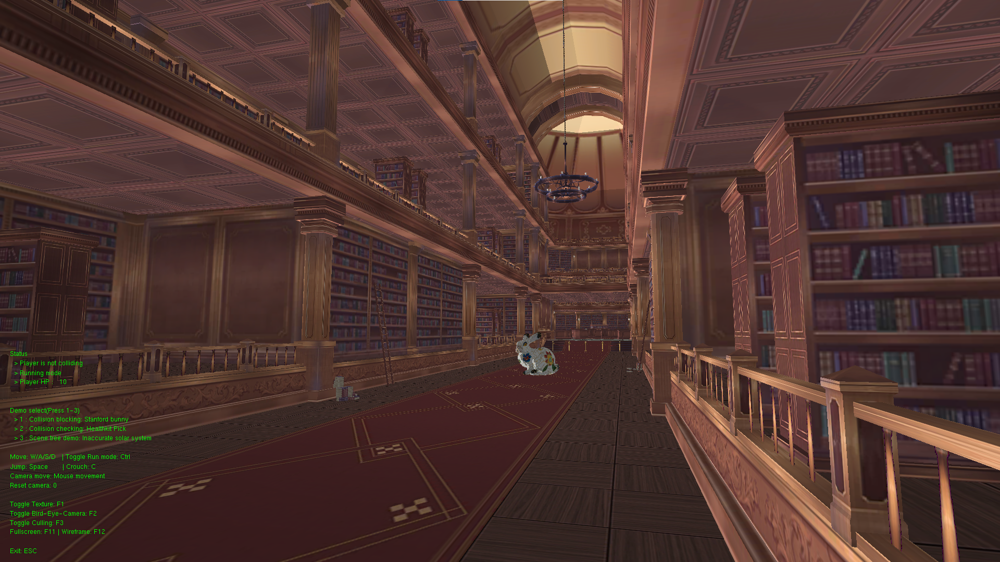

# OpenGL 2 Demo Application

This is a simple demo application for OpenGL 2 + GLFW.  
Some sources are come from [MU-software/foxsnow](https://github.com/MU-Software/FoxSnow) (which is currently re-writing now...)  
You can download executable on [here](http://hyperion.mudev.cc/shared/foxsnow_gl2_demo.zip).
